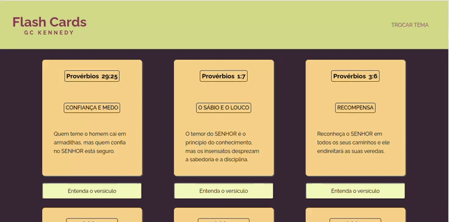
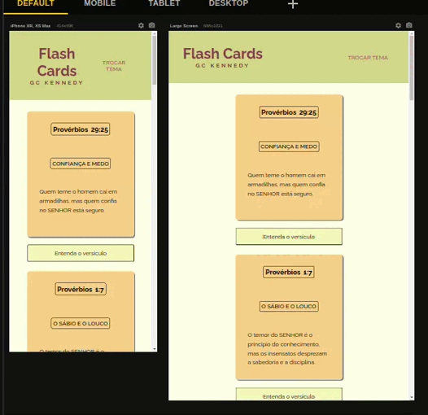

# Flash Cards GC Kennedy

### Desenvolvi esse projeto no intuito de otimizar o aprendizado bem como a exegese desses versículos. Estamos sempre com o celular em mãos em qualquer lugar e em qualquer ocasião. Assim, seja parado no trânsito, no carro de aplicatico, em uma fila de espera etc... , poderemos facilmente ler e entender a explicação sobre cada versículo e memorizar facilmente. Esse é o primeiro passo de um projeto muito maior e que envolverá muitas tecnologias e muito apredizado."


## Índice

- [Visão geral](#visão-geral)
- [Captura de tela](#captura-de-tela)
- [Construído com](#construído-com)
- [O que aprendi](#o-que-aprendi)
- [Desenvolvimento contínuo](#desenvolvimento-contínuo)
- [Recursos úteis](#recursos-úteis)
- [Fernando Mendes](#autor)
- [Agradecimentos](#agradecimentos)


## Visão geral

### Captura de tela

#### Tela Desktop

[]

#### Tela Responsiva

[]


### Construído com

- HTML5
- CSS3
- JavaScript

### O que eu aprendi

Nesse projeto envolvendo HTML, CSS e JavaScript, aprendi conceitos importantes. Através do CSS, aprendi a dar estilo e formatar elementos HTML, explorando propriedades como cores, fontes, posicionamento,animações e responsividade. 

Com JavaScript pude adicionar interatividade e dinamismo ao projeto. Com ele, aprendi a manipular elementos HTML, responder a eventos do usuário, criar animações e implementar lógica complexa.

Ao trabalhar com CSS e JavaScript em conjunto, aprendi a integrar essas duas linguagens para criar experiências ricas e interativas. Pude usar JavaScript para controlar o comportamento do CSS, modificando estilos com base em ações do usuário ou em eventos específicos.

No processo de aprendizado, foi importante entender os conceitos fundamentais de cada linguagem, como seletor de CSS, caixas-modelo, fluxo de renderização, manipulação do DOM, eventos, funções e estruturas de controle do JavaScript. Praticar esses conceitos em projetos reais nos ajuda a aprimorar nossas habilidades e explorar diferentes técnicas e soluções para os desafios que encontramos.

Concluir esse projeto, mesmo que só a primeira parte da ideia geral, me deu confiança para a construção de interfaces web cada vez mais atrativas e funcionais. 

## Trechos de códigos

``` 
JavaScript


botaoAlterarTema.addEventListener("click", () => {
  body.classList.contains("tema-dois");
 
  body.classList.toggle("tema-dois");


});


botaoMostrarExplicacao.addEventListener("click", () => {


  if(conteudoVersiculo.style.display === "block"){
    conteudoVersiculo.style.display = "none";
    } else{
    conteudoVersiculo.style.display = "block";
    }


    const card = document.querySelector(".conteudo-versiculo")
    card.classList.toggle("active")

    if(card.classList.contains("active")) {
      return botaoMostrarExplicacao.textContent = "Voltar"
    }
    

    botaoMostrarExplicacao.textContent = "Entenda o versículo"


});

 CSS

.header-title_subtitle {
   display: flex; 
   flex-wrap: wrap;
   justify-content: center;
   flex-direction: column;
   text-align: center;
}

.header-title {
    color: var(--text-color-header-title);
    font-size: 2.5rem;
}

.header-subtitle {
    color: var(--text-color-header-title);
    text-transform: uppercase;
    font-weight: bold;
    letter-spacing: 5px;
}

```

### Desenvolvimento contínuo

Pretendo continuar focado em construir um conhecimento sólido nessas limguagens. Ainda há muitos conceitos importantes para serem desenvolvidos. Todos os dias são gradativamente adicionados ao meu repertório de ferramentas.

### Recursos úteis

- [W3School](https://www.w3schools.com/css/default.asp) - Esse site sempre me ajuda a resolver qualquer problema relacionados a códigos de uma maneira fácil e muito rápida.
- [Dev em Dobro](https://www.youtube.com/@DevemDobro) - Este é um canal onde encontro muito material. Tem muito conteúdo relacionado ao desenvolvimento. Recomendo a todos que querem aprender sobre esse e outros conceitos relacionados.

## Autor

[Fernando Mendes](https://www.linkedin.com/in/fernandomendesti/)

## Agradecimentos

Gostaria de agradecer a toda comunidade do DEVQUEST: monitores, alunos e toda a equipe técnica que sempre está de prontidão para ajudar no que for preciso. Deixo aqui um abraço a todos que fazem parte desse projeto. Agradecer ao meu grupo de crescimento GC Kennedy que tem contribuido muito para o meu crescimento pessoal.


